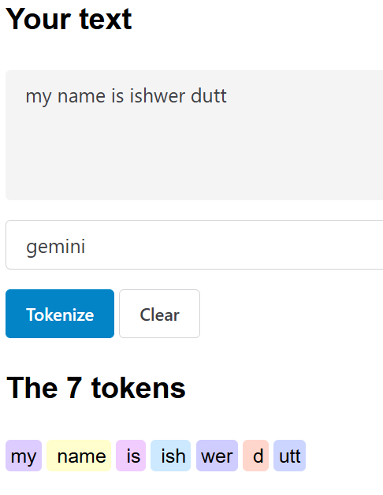

llms are AIs that genrate text
Input:- text
Output:- text
takes text as input and predicts the next word.
well now a days, you can ask a question to llm and it can also answer them.
LLMs, or Large Language Models, are a type of artificial intelligence designed to understand and generate human-like text. They are trained on vast amounts of data, allowing them to perform tasks like answering questions, summarizing information, translating languages, and even assisting with creative writing or coding.

Example:

LLM INput :- The sun is shining, and the sky is

1. Blue = 0.34 = p
2. clear = .25 = p 
3. etc and etc
above are the probabilities for the next word.
LLm will predict the word with maximum probability

METHODS FOR SELECTING FROM A PROBABILITY DISTRIBUTION

**TOP K sampling**

=>select from a number(k) most probable words
=>Example: If top_k = 3, pick from top 3 probable outcomes.

**TEMPERATURE SAMPLING**

Temperature sampling is a technique used in large language models (LLMs) to control the randomness of text generation. It adjusts the probability distribution of possible next words, influencing how creative or predictable the output is.
-> Lower temperature (e.g., 0.1 - 0.3): The model picks the most probable words, making responses more deterministic and structured.
-> Higher temperature (e.g., 0.7 - 1.0): The model introduces more randomness, leading to diverse and creative outputs.

For example, if an LLM is asked to complete the sentence "Once upon a time, a king...", a low temperature setting might generate "ruled a prosperous kingdom," while a high temperature setting could result in something unexpected like "discovered a portal to another dimension."

# TOKENS

Large Language Models (LLMs), tokens are the fundamental units of text that the model processes. Instead of working with entire words or sentences, *LLMs break down text into smaller chunks called tokens*. These can be:
- Word tokens : Each word is treated as a separate token.
- Subword tokens: Words are split into smaller meaningful parts (e.g., "jumping" → "jump" + "ing").
- Character tokens: Each individual character is a token (less common in modern models).
- Byte-Pair Encoding (BPE) tokens: A method that merges frequently occurring character sequences to create efficient tokenization.

For example, the sentence "The quick brown fox jumps over the lazy dog" might be tokenized as: ["The", "quick", "brown", "fox", "jump", "s", "over", "the", "lazy", "dog"] Here, "jumps" is split into "jump" and "s" to help the model understand word variations.

what kind of tokenization is best??
The best tokenization method depends on the specific needs of a Large Language Model (LLM) and the type of text it processes. Here are some common approaches:
- Word-Level Tokenization – Simple but inefficient for handling rare words.
- Character-Level Tokenization – Useful for languages with complex morphology but leads to long sequences.
- Subword Tokenization (e.g., Byte Pair Encoding, WordPiece, SentencePiece) – Balances vocabulary size and efficiency, making it popular in modern LLMs like GPT and BERT.
- Adaptive Tokenization – Dynamically adjusts based on context, improving performance in diverse datasets.

For LLMs, subword tokenization is often preferred because it reduces out-of-vocabulary issues while keeping sequences manageable. Want to explore how different models use tokenization? 

# Best Tokenizer Structure: Subword Tokenization
Subword tokenization strikes a balance between vocabulary size, efficiency, and handling rare or out-of-vocabulary words. It is commonly implemented using methods like Byte Pair Encoding (BPE), WordPiece, or SentencePiece.

**Key Features of Subword Tokenization:**
- andles Rare Words:

Breaks down rare or unknown words into smaller, meaningful subword units.
Example: "unbelievable" → ["un", "believ", "able"].
- Compact Vocabulary:

Reduces the size of the vocabulary compared to word-level tokenization.
Efficient for training and inference.
Language-Agnostic:

- Works well for languages with complex morphology (e.g., agglutinative languages like Finnish or Turkish).
Balances Sequence Length:

- Avoids excessively long sequences seen in character-level tokenization.
Popular Subword Tokenization Methods:
Byte Pair Encoding (BPE):

- Merges the most frequent pairs of characters or subwords iteratively.
Used in models like GPT and OpenAI's LLMs.
WordPiece:

- Similar to BPE but uses a probabilistic approach to merge subwords.
Used in models like BERT.
SentencePiece:

- Operates directly on raw text (e.g., without requiring whitespace tokenization).
Used in models like T5 and mBERT.
Adaptive Tokenization (Emerging Approach):
Adaptive tokenization dynamically adjusts based on the context or dataset. While less common, it is gaining traction for its ability to optimize performance across diverse datasets.
